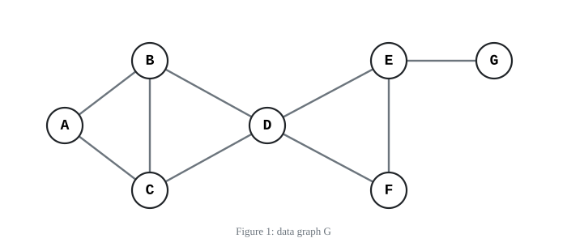
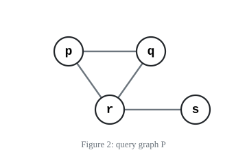
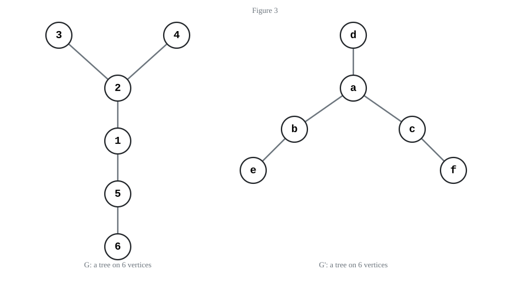
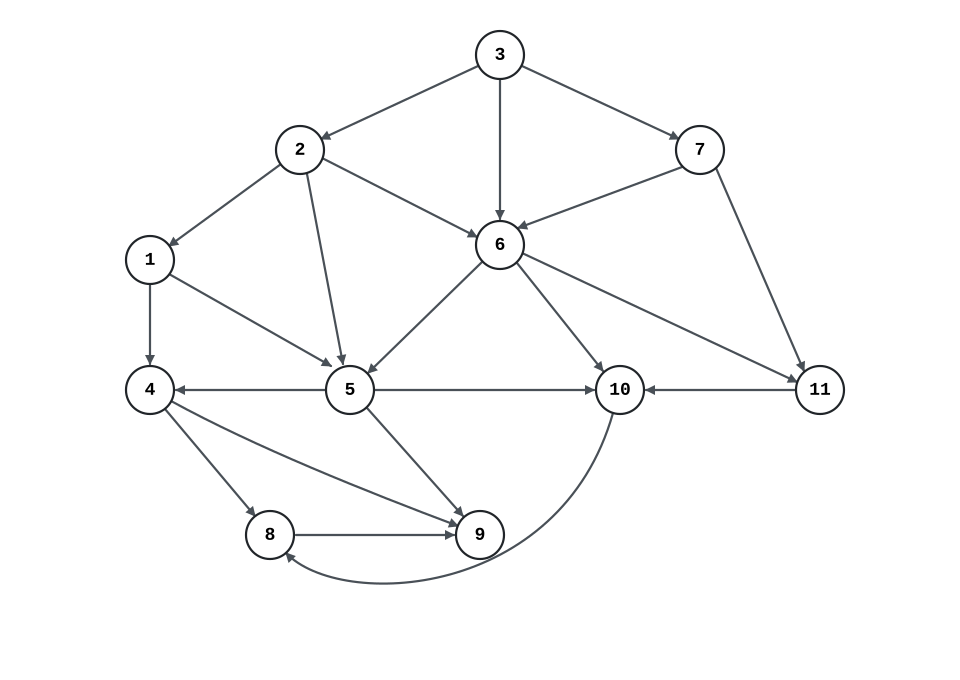
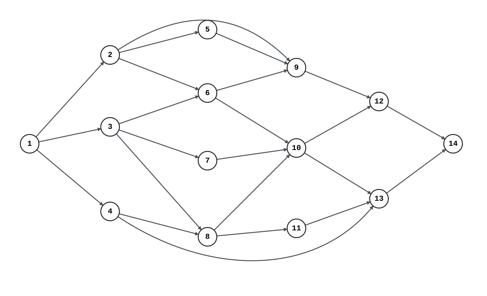
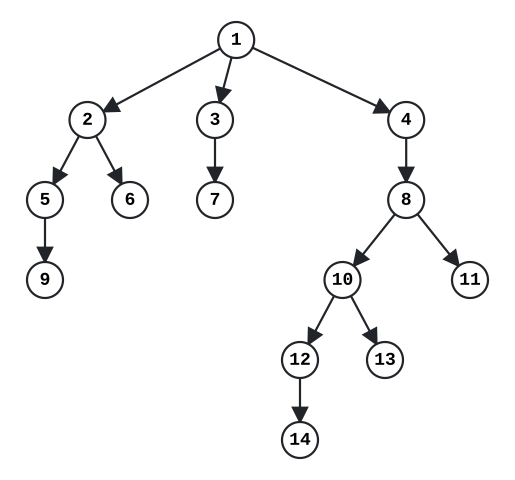
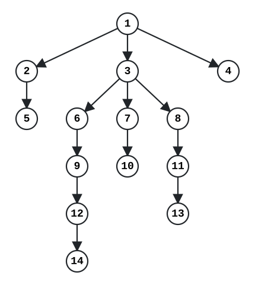
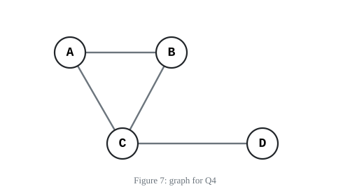

# COMP9312 — Assignment 2

**Graph Patterns, Graph Kernels, Reachability Indexing, and Graph Neural Networks**

Source: <https://cgi.cse.unsw.edu.au/~cs9312/26T2/assignments/ass2/ass2.html>

## Summary

| | |
| --- | --- |
| Submission | Submit one electronic copy of all answers through Moodle. Only the most recent submission will be assessed. |
| Required File | A single `.pdf` file named `ass2_Zid.pdf`, where `Zid` is your UNSW zID. |
| Deadline | **Fri 21:00 7 August** (Sydney Time) |
| Marks | **20** marks (**10%** toward the final mark for this course) |

##### Late penalty

A penalty of 5% of the maximum assignment mark will be deducted for each additional
calendar day, or part thereof, after the specified deadline. Submissions will not be
accepted more than 5 days (120 hours) after the deadline.

## Question Entries

| Question | Topic | Marks |
| --- | --- | --- |
| Q1 | Graph homomorphism and induced subgraph matching | 3 |
| Q2 | Weisfeiler-Lehman color refinement | 5 |
| Q3 | Reachability indexing: 2-hop labelling and tree cover | 8 |
| Q4 | One-layer GNN mean aggregation | 4 |

> **Note on the figures.** The question page draws every figure as inline SVG, so the
> graph structures are not present in its plain text. Each figure below is reproduced as
> a standalone SVG under [`assets/`](assets/), and is accompanied by a
> **machine-readable graph spec (YAML)** transcribed from the SVG coordinates, so the
> vertex and edge sets are unambiguous.

---

# Q1. Graph homomorphism and induced subgraph matching (3 marks)

## Problem Statement

We consider a data graph `G` in Figure 1 and a query graph `P` in Figure 2.



*Figure 1: data graph G*



*Figure 2: query graph P*

### Machine-Readable Graph Spec (YAML)

```yaml
data_graph_G:
  graph_id: q1_data_graph
  graph_type: undirected_unweighted
  nodes: [A, B, C, D, E, F, G]
  edges:
    - [A, B]
    - [A, C]
    - [B, C]
    - [B, D]
    - [C, D]
    - [D, E]
    - [D, F]
    - [E, F]
    - [E, G]
  # 7 vertices, 9 edges
  degrees: {A: 2, B: 3, C: 3, D: 4, E: 3, F: 2, G: 1}

query_graph_P:
  graph_id: q1_query_graph
  graph_type: undirected_unweighted
  nodes: [p, q, r, s]
  edges:
    - [p, q]
    - [p, r]
    - [q, r]
    - [r, s]
  # 4 vertices, 4 edges: a triangle {p,q,r} plus a pendant vertex s attached to r
  degrees: {p: 2, q: 2, r: 3, s: 1}
```

## Requirements

a. Determine whether a homomorphism from `P` to `G` exists. If it exists, give one
   mapping of `p`, `q`, `r`, and `s`. (1 mark)
b. List all unique vertex sets whose induced subgraphs in `G` are isomorphic to `P`.
   (2 marks)

## Marking

**Marking for Q1:** 1 mark for a valid homomorphism and 2 marks for a complete,
non-redundant list of induced subgraphs.

---

# Q2. Weisfeiler-Lehman color refinement (5 marks)

## Problem Statement

Figure 3 shows two graphs. Initially, every vertex has color 0.

In each Weisfeiler-Lehman (1-WL) refinement round, the new color of a vertex is
determined by a tuple consisting of its current color and the sorted list of its
neighbours' current colors. Repeated neighbour colors are retained.

Color IDs are assigned jointly for `G` and `G'`. At each round, the distinct tuples that
occur in either graph are sorted lexicographically. For each tuple in the order, it is
assigned the smallest unused integer color ID, starting from 0. Therefore, an ID denotes
the same tuple in both graphs. Let `phi_t(H)` be the color-count vector of graph `H`
after round `t`, with entries listed in increasing color-ID order.



*Figure 3 — left: `G`, a tree on 6 vertices; right: `G'`, a tree on 6 vertices*

### Machine-Readable Graph Spec (YAML)

```yaml
graph_G:
  graph_id: q2_tree_G
  graph_type: undirected_unweighted
  nodes: [1, 2, 3, 4, 5, 6]
  edges:
    - [2, 3]
    - [2, 4]
    - [1, 2]
    - [1, 5]
    - [5, 6]
  # tree; vertex 2 is the only degree-3 vertex, carrying leaves 3 and 4
  # and the path 2 - 1 - 5 - 6
  degrees: {1: 2, 2: 3, 3: 1, 4: 1, 5: 2, 6: 1}

graph_G_prime:
  graph_id: q2_tree_G_prime
  graph_type: undirected_unweighted
  nodes: [a, b, c, d, e, f]
  edges:
    - [a, d]
    - [a, b]
    - [a, c]
    - [b, e]
    - [c, f]
  # tree; vertex a is the only degree-3 vertex, carrying leaf d
  # and the two paths a - b - e and a - c - f
  degrees: {a: 3, b: 2, c: 2, d: 1, e: 1, f: 1}

# Both trees have degree sequence [3, 2, 2, 1, 1, 1] but are NOT isomorphic:
# the branches hanging off the degree-3 vertex have lengths 1,1,3 in G and 1,2,2 in G'.
```

## Requirements

a. Run two 1-WL refinement rounds. For each graph, list the tuple of every vertex in each
   round. Present the color-count vectors `phi_0`, `phi_1`, and `phi_2`. (4 marks)
b. Compute the two-round WL kernel. (1 mark)

$$K_{\mathrm{WL}}(G,G') = \sum_{t=0}^{2}\boldsymbol{\phi}_t(G)^{\mathsf T}\boldsymbol{\phi}_t(G').$$

## Marking

**Marking for Q2:** 4 marks for the refinement and color-count vectors, and 1 mark for
the kernel value.

---

# Q3. Reachability indexing: 2-hop labelling and tree cover (8 marks)

## (a) Minimal 2-hop labelling (4 marks)

Figure 4 shows a directed acyclic graph (DAG) `G`.



*Figure 4: a DAG for minimal 2-hop labelling.*

### Machine-Readable Graph Spec (YAML)

```yaml
graph_id: q3a_dag_2hop
graph_type: directed_acyclic
nodes: [1, 2, 3, 4, 5, 6, 7, 8, 9, 10, 11]
edges:            # directed, written as [tail, head] for tail -> head
  - [1, 4]
  - [1, 5]
  - [2, 1]
  - [2, 5]
  - [2, 6]
  - [3, 2]
  - [3, 6]
  - [3, 7]
  - [4, 8]
  - [4, 9]
  - [5, 4]
  - [5, 9]
  - [5, 10]
  - [6, 5]
  - [6, 10]
  - [6, 11]
  - [7, 6]
  - [7, 11]
  - [8, 9]
  - [10, 8]
  - [11, 10]
# 11 vertices, 21 edges
in_degree:  {1: 1, 2: 1, 3: 0, 4: 2, 5: 3, 6: 3, 7: 1, 8: 2, 9: 3, 10: 3, 11: 2}
out_degree: {1: 2, 2: 3, 3: 3, 4: 2, 5: 3, 6: 3, 7: 2, 8: 1, 9: 0, 10: 1, 11: 1}
total_degree: {1: 3, 2: 4, 3: 3, 4: 4, 5: 6, 6: 6, 7: 3, 8: 3, 9: 3, 10: 4, 11: 3}
```

### Requirements

- Compute the minimal 2-hop reachability labels `L_in(v)` and `L_out(v)` for each vertex
  `v` in `G`. Use the total-order-based 2-hop labelling algorithm from the lectures.
  Process vertices in decreasing total degrees, where the total degree of a vertex is the
  sum of in-degree and out-degree. Break ties by placing the smaller vertex ID first.

## (b) Comparing two spanning trees (4 marks)

Figure 5 shows a directed acyclic graph (DAG) `G`.



*Figure 5: directed acyclic graph for tree-cover labelling.*

Figure 6 shows two spanning trees of the graph in Figure 5.



*Figure 6, Tree 1*



*Figure 6, Tree 2*

### Machine-Readable Graph Spec (YAML)

```yaml
graph:
  graph_id: q3b_dag_treecover
  graph_type: directed_acyclic
  nodes: [1, 2, 3, 4, 5, 6, 7, 8, 9, 10, 11, 12, 13, 14]
  edges:
    - [1, 2]
    - [1, 3]
    - [1, 4]
    - [2, 5]
    - [2, 6]
    - [2, 9]
    - [3, 6]
    - [3, 7]
    - [3, 8]
    - [4, 8]
    - [4, 13]
    - [5, 9]
    - [6, 9]
    - [6, 10]
    - [7, 10]
    - [8, 10]
    - [8, 11]
    - [9, 12]
    - [10, 12]
    - [10, 13]
    - [11, 13]
    - [12, 14]
    - [13, 14]
  # 14 vertices, 23 edges; vertex 1 is the only source.
  # The identity order 1,2,...,14 is a topological order.

tree_1:
  # children are listed left-to-right exactly as drawn in Figure 6
  root: 1
  children:
    1: [2, 3, 4]
    2: [5, 6]
    3: [7]
    4: [8]
    5: [9]
    8: [10, 11]
    10: [12, 13]
    12: [14]
  non_tree_edges:
    [[2, 9], [3, 6], [3, 8], [4, 13], [6, 9], [6, 10], [7, 10], [9, 12],
     [11, 13], [13, 14]]

tree_2:
  root: 1
  children:
    1: [2, 3, 4]
    2: [5]
    3: [6, 7, 8]
    6: [9]
    7: [10]
    8: [11]
    9: [12]
    11: [13]
    12: [14]
  non_tree_edges:
    [[2, 6], [2, 9], [4, 8], [4, 13], [5, 9], [6, 10], [8, 10], [10, 12],
     [10, 13], [13, 14]]
```

### Requirements

1. Apply the tree-cover labelling algorithm based on each spanning tree. Present the final
   intervals (without any redundancy) for each vertex. (3 marks)
2. Which tree gives the better tree-cover labelling? Show the result and provide detailed
   justification. (1 mark)

## Marking

**Marking for Q3:** 4 marks for the correct minimal 2-hop labels in part (a), 3 marks for
the two tree-cover labellings in part (b), and 1 mark for the comparison.

---

# Q4. One-layer GNN mean aggregation (4 marks)

## Problem Statement

Figure 7 shows an undirected graph. Each vertex `v` has an initial two-dimensional
column-vector embedding `h_v^(0)`. A one-layer GNN first averages the initial embeddings
of all neighbours of `v`, then combines this average with `v`'s own embedding and applies
the following update:

$$h_{N(v)}^{(0)} = \frac{1}{|N(v)|}\sum_{u\in N(v)}h_u^{(0)}, \qquad
h_v^{(1)} = \mathrm{ReLU}\left( W\cdot\mathrm{CONCAT}\left(h_v^{(0)},h_{N(v)}^{(0)}\right) \right).$$

`N(v)` is the set of neighbours of `v`; it does not include `v` itself.
`ReLU(x) = max(0, x)` is applied element-wise. In `CONCAT(h_v^(0), h_N(v)^(0))`, the first
two entries are `v`'s own embedding and the last two are the neighbour mean, so the result
is a four-dimensional column vector.



*Figure 7: graph for Q4*

The rows of `H^(0)` give the initial embeddings of `A, B, C, D`. Since each `h_v^(0)` is a
column vector, its row in `H^(0)` is `h_v^(0)T`. The matrices `H^(0)` and `W` are:

$$H^{(0)} = \begin{pmatrix} 1 & 0 \\ 0 & 1 \\ 1 & 1 \\ 2 & 0 \end{pmatrix},
\qquad
W = \begin{pmatrix} 1 & -1 & 1 & 0 \\ 0 & 1 & -1 & 1 \end{pmatrix}.$$

### Machine-Readable Graph Spec (YAML)

```yaml
graph_id: q4_gnn_graph
graph_type: undirected_unweighted
nodes: [A, B, C, D]
edges:
  - [A, B]
  - [A, C]
  - [B, C]
  - [C, D]
# 4 vertices, 4 edges: triangle {A,B,C} plus a pendant vertex D attached to C
neighbourhoods:
  A: [B, C]
  B: [A, C]
  C: [A, B, D]
  D: [C]
initial_embeddings:   # h_v^(0), written as the row of H^(0)
  A: [1, 0]
  B: [0, 1]
  C: [1, 1]
  D: [2, 0]
weight_matrix_W:      # 2 x 4
  - [1, -1, 1, 0]
  - [0, 1, -1, 1]
added_edge_in_part_b: [B, D]
```

## Requirements

a. For `B` and `C`, calculate the neighbour mean, the concatenated input vector, and the
   final embedding. Round each entry of the final embedding to two decimal places.
   (3 marks)
b. Add the edge `B--D`, without changing any initial embedding `h_v^(0)`. Recompute the
   one-layer update and list every vertex whose new embedding `h_v^(1)` differs from its
   embedding before the edge was added. (1 mark)

## Marking

**Marking for Q4:** 3 marks for the two neighbour means, concatenated inputs, and updated
embeddings in part (a), and 1 mark for the affected-vertex set in part (b).

---
---

# COMP9312 — 作业二 · 中文版

**图模式匹配、图核、可达性索引与图神经网络**

题面来源：<https://cgi.cse.unsw.edu.au/~cs9312/26T2/assignments/ass2/ass2.html>

## 摘要

| | |
| --- | --- |
| 提交方式 | 在 Moodle 提交一份电子版答案，只会评阅最后一次提交。 |
| 要提交的文件 | 单个 PDF 文件，命名为 `ass2_Zid.pdf`，其中 `Zid` 是你的 UNSW zID。 |
| 截止时间 | **8 月 7 日（周五）晚 21:00**（悉尼时间） |
| 分值 | **20** 分（占本课程总评 **10%**） |

##### 迟交扣分

超过截止时间后，每多出一个自然日（不足一日按一日计）扣该作业满分的 5%。截止后
超过 5 天（120 小时）不再接受提交。

## 题目一览

| 题号 | 主题 | 分值 |
| --- | --- | --- |
| Q1 | 图同态与诱导子图匹配 | 3 |
| Q2 | Weisfeiler-Lehman 颜色精化 | 5 |
| Q3 | 可达性索引：2-hop 标签与 tree cover | 8 |
| Q4 | 单层 GNN 平均聚合 | 4 |

> **关于插图的说明。** 原题页面的所有图都是内联 SVG，网页纯文本里并不包含图结构。
> 下面每张图都以独立 SVG 存放在 [`assets/`](assets/) 目录，并附上从 SVG 坐标逐条
> 还原出的 **机器可读图谱（YAML）**，因此点集与边集是没有歧义的。

---

# Q1. 图同态与诱导子图匹配（3 分）

## 题目描述

考虑图 1 中的数据图 `G` 和图 2 中的查询图 `P`。图结构见上文英文部分的
[Figure 1](assets/fig1_data_graph_G.svg) / [Figure 2](assets/fig2_query_graph_P.svg)
与对应的 YAML：`G` 有 7 个点、9 条边；`P` 有 4 个点、4 条边，形状是三角形
`{p,q,r}` 再挂一个悬挂点 `s` 在 `r` 上。

## 要求

a. 判断从 `P` 到 `G` 的同态是否存在。若存在，给出 `p`、`q`、`r`、`s` 的一个映射。（1 分）
b. 列出 `G` 中所有诱导子图与 `P` 同构的点集（不重复）。（2 分）

## 评分

**Q1 评分：** 给出一个合法同态得 1 分；完整且无冗余地列出全部诱导子图得 2 分。

---

# Q2. Weisfeiler-Lehman 颜色精化（5 分）

## 题目描述

图 3 给出两个图，初始时每个顶点的颜色都是 0。

在每一轮 Weisfeiler-Lehman（1-WL）精化中，一个顶点的新颜色由一个二元组决定：它当前的
颜色，以及其邻居当前颜色的**排序列表**（重复的邻居颜色要保留）。

颜色 ID 在 `G` 与 `G'` 之间**联合**分配：每一轮把出现在任一图中的所有不同二元组按字典序
排序，按顺序从 0 开始依次分配最小的未使用整数 ID。因此同一个 ID 在两个图中代表同一个
二元组。记 `phi_t(H)` 为图 `H` 在第 `t` 轮后的颜色计数向量，分量按颜色 ID 递增排列。

图结构见 [Figure 3](assets/fig3_wl_trees.svg) 与上文 YAML：`G` 的边为
`2-3, 2-4, 1-2, 1-5, 5-6`；`G'` 的边为 `a-d, a-b, a-c, b-e, c-f`。两棵树的度序列都是
`[3,2,2,1,1,1]`，但并不同构。

## 要求

a. 执行两轮 1-WL 精化。对每个图，列出每一轮中每个顶点的二元组，并给出颜色计数向量
   `phi_0`、`phi_1`、`phi_2`。（4 分）
b. 计算两轮 WL 核 `K_WL(G, G') = sum_{t=0..2} phi_t(G)^T · phi_t(G')`。（1 分）

## 评分

**Q2 评分：** 精化过程与颜色计数向量 4 分，核值 1 分。

---

# Q3. 可达性索引：2-hop 标签与 tree cover（8 分）

## (a) 最小 2-hop 标签（4 分）

图 4 是一个有向无环图（DAG）`G`，见 [Figure 4](assets/fig4_dag_2hop.svg) 与上文 YAML
（11 个点、21 条边）。

### 要求

- 计算 `G` 中每个顶点 `v` 的最小 2-hop 可达性标签 `L_in(v)` 与 `L_out(v)`。使用课上讲的
  基于全序的 2-hop 标签算法。顶点按**总度数递减**的顺序处理，总度数 = 入度 + 出度；
  总度数相同时，顶点编号小的排前面。

## (b) 比较两棵生成树（4 分）

图 5 是一个 DAG，见 [Figure 5](assets/fig5_dag_treecover.svg)（14 个点、23 条边）；
图 6 给出它的两棵生成树，见 [Tree 1](assets/fig6a_tree1.svg) 与
[Tree 2](assets/fig6b_tree2.svg)。两棵树的孩子顺序（自左至右）已记录在上文 YAML 中。

### 要求

1. 基于每棵生成树分别应用 tree-cover 标签算法，给出每个顶点最终的区间（去掉冗余）。（3 分）
2. 哪棵树给出更好的 tree-cover 标签？给出结果并作详细论证。（1 分）

## 评分

**Q3 评分：** (a) 正确的最小 2-hop 标签 4 分；(b) 两组 tree-cover 标签 3 分，比较论证 1 分。

---

# Q4. 单层 GNN 平均聚合（4 分）

## 题目描述

图 7 是一个无向图，见 [Figure 7](assets/fig7_gnn_graph.svg)（边为 `A-B, A-C, B-C, C-D`）。
每个顶点 `v` 有一个二维列向量初始嵌入 `h_v^(0)`。单层 GNN 先对 `v` 的所有邻居的初始嵌入
取平均，再把该平均值与 `v` 自身的嵌入拼接后做如下更新：

```
h_N(v)^(0) = (1 / |N(v)|) * sum_{u in N(v)} h_u^(0)
h_v^(1)    = ReLU( W · CONCAT( h_v^(0), h_N(v)^(0) ) )
```

`N(v)` 是 `v` 的邻居集合，**不含** `v` 自身；`ReLU(x) = max(0, x)` 按元素作用。
在 `CONCAT(h_v^(0), h_N(v)^(0))` 中，前两个分量是 `v` 自身的嵌入，后两个分量是邻居均值，
因此结果是四维列向量。

`H^(0)` 的各行依次是 `A, B, C, D` 的初始嵌入（由于 `h_v^(0)` 是列向量，它在 `H^(0)` 中的
那一行是 `h_v^(0)T`）：

```
H^(0) = [[1, 0],        W = [[1, -1,  1, 0],
         [0, 1],             [0,  1, -1, 1]]
         [1, 1],
         [2, 0]]
```

## 要求

a. 对 `B` 和 `C`，计算邻居均值、拼接后的输入向量以及最终嵌入。最终嵌入的每个分量保留
   两位小数。（3 分）
b. 加入边 `B--D`（不改变任何初始嵌入 `h_v^(0)`），重新计算这一层的更新，并列出所有新嵌入
   `h_v^(1)` 与加边前不同的顶点。（1 分）

## 评分

**Q4 评分：** (a) 两个邻居均值、拼接输入与更新后嵌入 3 分；(b) 受影响顶点集合 1 分。
